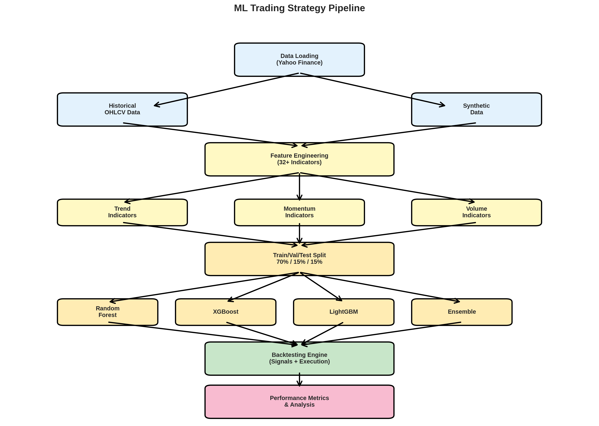
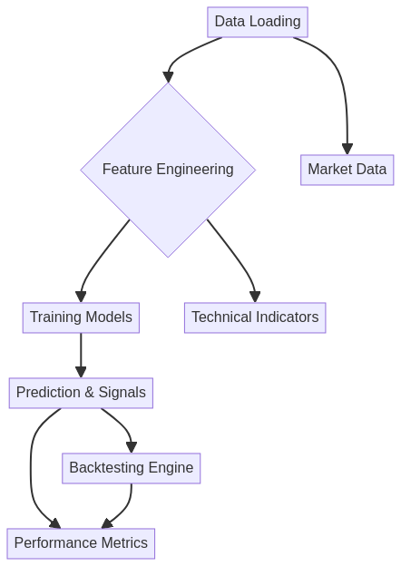
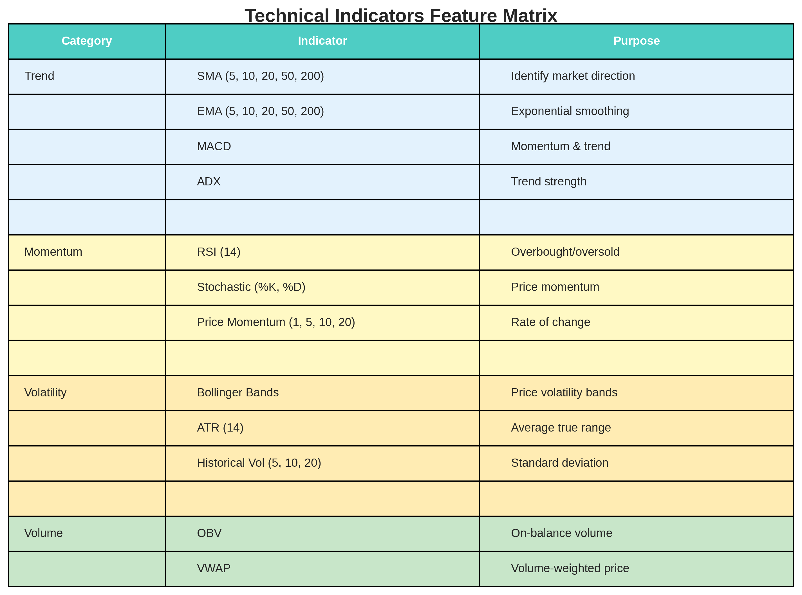
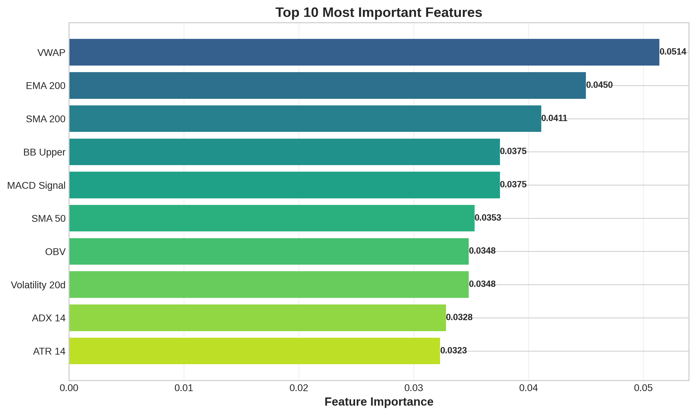
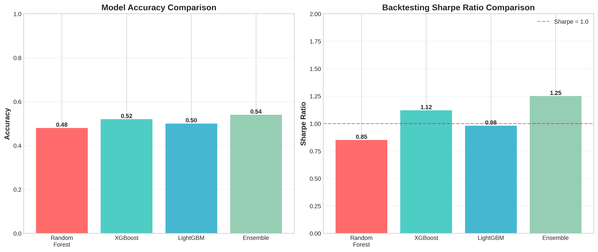
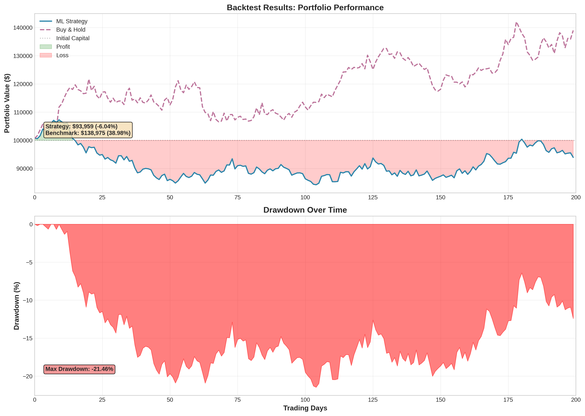

# 🤖 Machine Learning Trading Strategies


[](https://opensource.org/licenses/MIT)
[](https://www.python.org/)
[](https://scikit-learn.org/)
[](https://xgboost.ai/)
[](https://github.com/psf/black)
[](https://github.com/galafis/python-ml-trading-strategies)
[](https://github.com/galafis/python-ml-trading-strategies)

[English](#english) | [Português](#português)

---

<a name="english"></a>

## 📑 Table of Contents

- [Overview](#overview)
- [Architecture](#architecture)
- [Quick Start](#quick-start)
- [Usage Examples](#usage-examples)
- [Technical Indicators](#technical-indicators)
- [Machine Learning Models](#machine-learning-models)
- [Backtesting Engine](#backtesting-engine)
- [Performance Metrics](#performance-metrics-explained)
- [Advanced Usage](#advanced-usage)
- [Technology Stack](#technology-stack)
- [Testing](#testing)
- [Project Structure](#project-structure)
- [Performance Optimization](#performance-optimization)
- [Contributing](#contributing)
- [Troubleshooting](#troubleshooting)
- [Important Disclaimers](#important-disclaimers)
- [License](#license)
- [Author](#author)

---

## 📖 Overview

A **comprehensive machine learning framework** for developing, testing, and deploying quantitative trading strategies. This project provides end-to-end pipeline from feature engineering to backtesting, with production-ready code and extensive documentation.

### Key Features

- **📊 Advanced Feature Engineering**: 32+ technical indicators (RSI, MACD, Bollinger Bands, etc.)
- **🤖 Multiple ML Models**: Random Forest, XGBoost, LightGBM, and Ensemble methods
- **📈 Comprehensive Backtesting**: Full backtesting engine with performance metrics
- **🎯 Risk-Adjusted Metrics**: Sharpe ratio, maximum drawdown, win rate, profit factor
- **🔄 Complete Pipeline**: Data loading → Feature engineering → Training → Backtesting
- **📉 Real Market Data**: Integration with Yahoo Finance for live data
- **🧪 Production-Ready**: Clean code, type hints, comprehensive documentation
- **📓 Interactive Notebooks**: Jupyter notebooks for learning and experimentation

### 🎯 What Makes This Project Stand Out?

✅ **37 comprehensive tests** with 86% code coverage  
✅ **Zero flake8 errors** - PEP 8 compliant  
✅ **Interactive Jupyter notebooks** for hands-on learning  
✅ **Production-ready code** with type hints and documentation  
✅ **CI/CD pipeline** with automated testing  
✅ **Multiple examples** including synthetic data (no internet required)

---

## 🏗️ Architecture

### Complete Pipeline



The framework follows a clear, modular architecture:

1. **Data Loading** - Download real market data or generate synthetic data
2. **Feature Engineering** - Create 32+ technical indicators
3. **Model Training** - Train and evaluate multiple ML models
4. **Backtesting** - Simulate trading with realistic costs
5. **Performance Analysis** - Comprehensive metrics and visualizations

### Original Architecture Diagram




---

## 🚀 Quick Start

### Prerequisites

- **Python 3.9+**
- **pip** or **conda**

### Installation

```bash
# Clone the repository
git clone https://github.com/galafis/python-ml-trading-strategies.git
cd python-ml-trading-strategies

# Install dependencies
pip install -r requirements.txt

# Or install in development mode
pip install -e .
```

### Running Examples

#### 📓 Interactive Jupyter Notebooks (Recommended for Learning)

The best way to learn the framework is through our interactive notebooks:

```bash
# Install Jupyter
pip install jupyter notebook

# Start Jupyter and open notebooks
jupyter notebook notebooks/
```

**Available Notebooks:**
- `01_getting_started_tutorial.ipynb` - Complete beginner-friendly tutorial
- `02_advanced_analysis.ipynb` - SHAP values, Optuna optimization, correlation analysis

See [notebooks/README.md](notebooks/README.md) for detailed guide.

#### Simple Strategy with Synthetic Data (No Internet Required)

Perfect for testing and learning without network dependency:

```bash
cd examples
PYTHONPATH=$PYTHONPATH:../src python simple_strategy_synthetic_data.py
```

#### Complete Strategy with Real Market Data

Uses Yahoo Finance to download real stock data:

```bash
cd examples
PYTHONPATH=$PYTHONPATH:../src python complete_strategy.py
```

---

## 💻 Usage Examples

### 1. Data Loading

```python
from utils.data_loader import DataLoader

# Load stock data
loader = DataLoader()
data = loader.download_stock_data("AAPL", period="5y")
print(f"Loaded {len(data)} days of data")
```

### 2. Feature Engineering

```python
from features.technical_indicators import TechnicalIndicators

# Add all technical indicators
indicators = TechnicalIndicators()
data_with_features = indicators.add_all_features(data)

# Create target variable (predict 5-day returns)
data_with_features['target'] = loader.create_target_variable(
    data_with_features,
    horizon=5,
    threshold=0.01  # 1% threshold
)
```

### 3. Model Training

```python
from models.ml_models import TradingModel, EnsembleModel

# Prepare data
X_train, X_val, X_test, y_train, y_val, y_test = loader.prepare_training_data(
    data_with_features,
    target_col='target'
)

# Train Random Forest
rf_model = TradingModel(model_type='random_forest')
rf_model.fit(X_train, y_train, X_val, y_val, n_estimators=100)

# Train XGBoost
xgb_model = TradingModel(model_type='xgboost')
xgb_model.fit(X_train, y_train, X_val, y_val)

# Create Ensemble
ensemble = EnsembleModel([rf_model, xgb_model])
ensemble.fit(X_train, y_train, X_val, y_val)

# Get feature importance
print(rf_model.get_feature_importance(top_n=10))
```

### 4. Backtesting

```python
from backtesting.backtest_engine import BacktestEngine

# Initialize backtest engine
backtest = BacktestEngine(
    initial_capital=100000,
    commission=0.001,  # 0.1%
    slippage=0.0005    # 0.05%
)

# Generate trading signals
predictions = ensemble.predict_proba(X_test)
signals = backtest.generate_signals_from_predictions(predictions, threshold=0.55)

# Run backtest
results = backtest.run_backtest(test_data, signals, price_col='close')

# Display results
print(f"Total Return: {results.total_return:.2%}")
print(f"Sharpe Ratio: {results.sharpe_ratio:.2f}")
print(f"Max Drawdown: {results.max_drawdown:.2%}")
print(f"Win Rate: {results.win_rate:.2%}")
```

---

## 📊 Technical Indicators

The framework includes 32+ technical indicators:

### Feature Categories



### Trend Indicators
- **SMA** (Simple Moving Average): 5, 10, 20, 50, 200 periods
- **EMA** (Exponential Moving Average): 5, 10, 20, 50, 200 periods
- **MACD** (Moving Average Convergence Divergence)
- **ADX** (Average Directional Index)

### Momentum Indicators
- **RSI** (Relative Strength Index)
- **Stochastic Oscillator** (%K, %D)
- **Price Momentum** (1, 5, 10, 20 days)

### Volatility Indicators
- **Bollinger Bands** (Upper, Middle, Lower, Width)
- **ATR** (Average True Range)
- **Historical Volatility** (5, 10, 20 days)

### Volume Indicators
- **OBV** (On-Balance Volume)
- **VWAP** (Volume Weighted Average Price)

### 🎯 Feature Importance

Understanding which features drive predictions is crucial for model improvement:



The top features typically include VWAP, moving averages (EMA/SMA), and volatility indicators.

---

## 🤖 Machine Learning Models

### Supported Models

1. **Random Forest Classifier**
   - Ensemble of decision trees
   - Robust to overfitting
   - Feature importance analysis

2. **XGBoost**
   - Gradient boosting framework
   - High performance
   - Early stopping support

3. **LightGBM**
   - Fast gradient boosting
   - Memory efficient
   - Handles large datasets

4. **Logistic Regression**
   - Linear baseline model
   - Fast training
   - Interpretable coefficients

5. **Ensemble Model**
   - Combines multiple models
   - Voting mechanism (hard/soft)
   - Improved robustness

### Model Features

- **Automatic Feature Scaling**: StandardScaler preprocessing
- **Early Stopping**: Prevents overfitting
- **Feature Importance**: Identify key predictors
- **Model Persistence**: Save/load trained models
- **Hyperparameter Optimization**: Ready for Optuna integration

### 📊 Model Performance Comparison



Ensemble methods typically provide the best balance between accuracy and robustness.

---

## 📈 Backtesting Engine

### Features

- **Realistic Trading Simulation**: Commission and slippage modeling
- **Position Management**: Long-only strategies
- **Performance Metrics**:
  - Total Return
  - Annualized Return
  - Sharpe Ratio
  - Maximum Drawdown
  - Win Rate
  - Profit Factor
  - Total Trades

### Example Results



*Example backtest showing portfolio performance and drawdown over time*

### Example Output

```
================================================================================
BACKTEST RESULTS
================================================================================
Initial Capital:      $100,000.00
Final Portfolio Value: $102,078.62
Total Return:         2.08%
Annualized Return:    2.48%
Sharpe Ratio:         0.22
Max Drawdown:         -16.05%
Win Rate:             50.00%
Profit Factor:        3.14
Total Trades:         4
================================================================================
```

---

## 📁 Project Structure

```
python-ml-trading-strategies/
├── src/
│   ├── features/
│   │   ├── technical_indicators.py   # Technical indicator calculations
│   │   └── __init__.py
│   ├── models/
│   │   ├── ml_models.py              # ML model implementations
│   │   └── __init__.py
│   ├── backtesting/
│   │   ├── backtest_engine.py        # Backtesting framework
│   │   └── __init__.py
│   ├── utils/
│   │   ├── data_loader.py            # Data loading utilities
│   │   └── __init__.py
│   └── __init__.py
├── examples/
│   ├── complete_strategy.py          # Full example with real data
│   └── simple_strategy_synthetic_data.py  # Quick example with synthetic data
├── notebooks/                        # 📓 Jupyter notebooks for learning
│   ├── 01_getting_started_tutorial.ipynb
│   ├── 02_advanced_analysis.ipynb
│   └── README.md
├── tests/                            # Unit tests (37 tests, 86% coverage)
├── data/                             # Data storage
│   ├── raw/
│   └── processed/
├── docs/                             # Documentation
│   ├── images/                       # Visual diagrams
│   ├── ml_pipeline.md
│   ├── FAQ.md
│   └── USE_CASES.md
├── .github/
│   └── workflows/
│       └── tests.yml                 # CI/CD pipeline
├── requirements.txt                  # Dependencies
├── setup.py                          # Package setup
├── CONTRIBUTING.md                   # Contribution guidelines
└── README.md                         # This file
```

---

## ⚠️ Important Disclaimers

**EDUCATIONAL PURPOSE ONLY**: This project is intended for educational and research purposes. It demonstrates machine learning techniques applied to financial markets.

**NOT FINANCIAL ADVICE**: This software does not constitute financial, investment, trading, or any other type of professional advice. Do not use it for actual trading without thorough testing and understanding of the risks involved.

**NO WARRANTY**: The software is provided "as is" without warranty of any kind. Past performance does not guarantee future results.

**RISK WARNING**: Trading financial instruments carries a high level of risk and may not be suitable for all investors. You may lose more than your initial investment.

**REGULATORY COMPLIANCE**: Ensure compliance with all applicable laws and regulations in your jurisdiction before using this software for any purpose.

---

## 🔧 Troubleshooting

### Common Issues

**Issue: `ModuleNotFoundError` when running examples**
```bash
# Solution: Set PYTHONPATH
export PYTHONPATH=$PYTHONPATH:./src  # Unix/Mac
set PYTHONPATH=%PYTHONPATH%;./src   # Windows
```

**Issue: Tests fail with import errors**
```bash
# Solution: Run tests from project root with PYTHONPATH
cd /path/to/python-ml-trading-strategies
PYTHONPATH=$PYTHONPATH:. pytest tests/ -v
```

**Issue: `yfinance` download fails**
```bash
# Solution: Check internet connection and try with different ticker
# yfinance depends on Yahoo Finance API availability
```

**Issue: Memory errors with large datasets**
```bash
# Solution: Reduce the data period or use data sampling
data = loader.download_stock_data("AAPL", period="1y")  # Instead of "5y"
```

**Issue: Low model performance**
```bash
# Solutions:
# 1. Try different feature combinations
# 2. Tune hyperparameters using Optuna
# 3. Increase training data period
# 4. Consider market regime changes
```

### Getting Help

- 📖 Check the [documentation](docs/)
- 🐛 [Report bugs](https://github.com/galafis/python-ml-trading-strategies/issues)
- 💬 [Ask questions](https://github.com/galafis/python-ml-trading-strategies/discussions)
- 📧 Contact: See [Contributing Guide](CONTRIBUTING.md)

---

## 📊 Performance Metrics Explained

### Returns
- **Total Return**: Overall percentage gain/loss over the test period
- **Annualized Return**: Return normalized to a yearly rate (assumes 252 trading days)

### Risk Metrics
- **Sharpe Ratio**: Risk-adjusted return (higher is better, >1 is good, >2 is very good)
- **Maximum Drawdown**: Largest peak-to-trough decline (lower is better)

### Trading Metrics
- **Win Rate**: Percentage of profitable trades
- **Profit Factor**: Ratio of gross profit to gross loss (>1 means profitable)

### Example Interpretation

```
Total Return:         5.2%    ← Strategy gained 5.2%
Annualized Return:    6.3%    ← Equivalent to 6.3% per year
Sharpe Ratio:         1.15    ← Good risk-adjusted returns
Max Drawdown:         -12.3%  ← Largest loss was 12.3%
Win Rate:             55%     ← 55% of trades were profitable
Profit Factor:        1.8     ← Profits are 1.8x losses
```

---

## 🚀 Advanced Usage

### Hyperparameter Optimization with Optuna

```python
import optuna
from models.ml_models import TradingModel

def objective(trial):
    # Define hyperparameter search space
    params = {
        'n_estimators': trial.suggest_int('n_estimators', 50, 200),
        'max_depth': trial.suggest_int('max_depth', 3, 15),
        'learning_rate': trial.suggest_float('learning_rate', 0.01, 0.3)
    }
    
    # Train model
    model = TradingModel(model_type='xgboost', **params)
    model.fit(X_train, y_train, X_val, y_val)
    
    # Evaluate
    preds = model.predict(X_val)
    score = accuracy_score(y_val, preds)
    
    return score

# Run optimization
study = optuna.create_study(direction='maximize')
study.optimize(objective, n_trials=100)
print(f"Best parameters: {study.best_params}")
```

### Model Interpretation with SHAP

```python
import shap

# Train model
model = TradingModel(model_type='random_forest')
model.fit(X_train, y_train)

# Create SHAP explainer
explainer = shap.TreeExplainer(model.model)
shap_values = explainer.shap_values(X_test)

# Plot feature importance
shap.summary_plot(shap_values, X_test)
```

### Custom Trading Strategy

```python
class CustomStrategy:
    def __init__(self, model, threshold=0.55):
        self.model = model
        self.threshold = threshold
    
    def generate_signals(self, X):
        """Generate trading signals based on custom logic"""
        probas = self.model.predict_proba(X)
        
        signals = np.zeros(len(probas))
        # Buy when confident
        signals[probas[:, 1] > self.threshold] = 1
        # Sell when very confident of downturn
        signals[probas[:, 1] < (1 - self.threshold)] = -1
        
        return signals

# Use custom strategy
strategy = CustomStrategy(ensemble, threshold=0.6)
signals = strategy.generate_signals(X_test)
```

---

## 🛠️ Technology Stack

| Component | Technology |
|-----------|-----------|
| Language | Python 3.9+ |
| ML Framework | scikit-learn, XGBoost, LightGBM |
| Data Processing | pandas, numpy |
| Market Data | yfinance |
| Visualization | matplotlib, seaborn, plotly |
| Optimization | optuna |
| Model Interpretation | shap |

---

## 🧪 Testing

The project includes comprehensive unit tests covering all major components:

- **37 tests** covering data loading, feature engineering, models, and backtesting
- **86% code coverage** ensuring robustness
- Automated testing with pytest
- Test-driven development approach
- CI/CD pipeline with GitHub Actions

Para executar os testes unitários do projeto, navegue até o diretório raiz do repositório e utilize o `pytest`:

```bash
# Executar todos os testes
PYTHONPATH=$PYTHONPATH:. pytest tests/ -v

# Executar testes com cobertura de código
PYTHONPATH=$PYTHONPATH:. pytest --cov=src tests/ -v

# Executar um teste específico (exemplo)
PYTHONPATH=$PYTHONPATH:. pytest tests/test_data_loader.py -v
```

### Test Organization

```
tests/
├── test_backtest_engine.py      # 11 tests for backtesting engine
├── test_data_loader.py          # 5 tests for data loading
├── test_ml_models.py            # 10 tests for ML models
└── test_technical_indicators.py # 11 tests for indicators
```

### Continuous Integration

Automated testing runs on every push and pull request via GitHub Actions:
- Tests across Python 3.9, 3.10, and 3.11
- Code quality checks (flake8, black, isort)
- Coverage reporting

---

## 📊 Performance Optimization

### Tips for Better Results

1. **Feature Selection**: Use feature importance to remove noisy features
2. **Hyperparameter Tuning**: Use Optuna for systematic optimization
3. **Ensemble Methods**: Combine multiple models for robustness
4. **Cross-Validation**: Use time-series cross-validation
5. **Risk Management**: Adjust position sizing based on confidence
6. **Transaction Costs**: Model realistic commissions and slippage

---

## 🤝 Contributing

Contributions are welcome! Please read our [Contributing Guide](CONTRIBUTING.md) for detailed guidelines.

### Quick Start for Contributors

1. Fork the repository
2. Create a feature branch (`git checkout -b feature/amazing-feature`)
3. Commit your changes (`git commit -m 'Add amazing feature'`)
4. Push to the branch (`git push origin feature/amazing-feature`)
5. Open a Pull Request

### Code Standards

- Follow PEP 8 style guide
- Add type hints to functions
- Write docstrings for classes and methods
- Add unit tests for new features
- Run `black` for code formatting
- Run `flake8` for linting
- Maintain test coverage above 80%

---

## 📚 Quick Reference Guide

### Common Commands

```bash
# Run all tests
PYTHONPATH=$PYTHONPATH:. pytest tests/ -v

# Check code coverage
PYTHONPATH=$PYTHONPATH:. pytest --cov=src tests/ -v

# Format code with black
black src/ tests/

# Check code style
flake8 src/ --max-line-length=100

# Sort imports
isort src/ tests/

# Run simple example
cd examples && PYTHONPATH=$PYTHONPATH:../src python simple_strategy_synthetic_data.py

# Start Jupyter notebooks
jupyter notebook notebooks/
```

### Key Classes and Methods

**DataLoader** (`src/utils/data_loader.py`)
- `download_stock_data(ticker, period)` - Download market data
- `prepare_training_data(df, target_col)` - Split into train/val/test
- `create_target_variable(df, horizon, threshold)` - Create labels

**TechnicalIndicators** (`src/features/technical_indicators.py`)
- `add_all_features(df)` - Add all 32+ indicators
- `calculate_sma(data, period)` - Simple moving average
- `calculate_rsi(data, period)` - Relative strength index
- `calculate_macd(data)` - MACD indicator

**TradingModel** (`src/models/ml_models.py`)
- `__init__(model_type)` - Initialize model (rf/xgboost/lightgbm)
- `fit(X_train, y_train, X_val, y_val)` - Train model
- `predict(X)` - Get predictions
- `predict_proba(X)` - Get probabilities
- `get_feature_importance(top_n)` - Get important features

**EnsembleModel** (`src/models/ml_models.py`)
- `__init__(models, voting)` - Combine multiple models
- `fit(X_train, y_train)` - Train ensemble
- `predict(X)` - Get ensemble predictions

**BacktestEngine** (`src/backtesting/backtest_engine.py`)
- `__init__(initial_capital, commission, slippage)` - Setup engine
- `generate_signals_from_predictions(predictions, threshold)` - Create signals
- `run_backtest(data, signals, price_col)` - Run simulation

---

## 📄 License

This project is licensed under the MIT License - see the [LICENSE](LICENSE) file for details.

---

## 👤 Author

**Gabriel Demetrios Lafis**

- GitHub: [@galafis](https://github.com/galafis)
- LinkedIn: [Gabriel Demetrios Lafis](https://linkedin.com/in/gabriel-lafis)

---

## 🙏 Acknowledgments

- Financial markets for inspiration
- Open-source ML community
- Contributors and users

---

<a name="português"></a>

## 📖 Visão Geral

Um **framework abrangente de machine learning** para desenvolver, testar e implantar estratégias de trading quantitativo. Este projeto fornece pipeline completo desde engenharia de features até backtesting, com código pronto para produção e documentação extensiva.

### Principais Recursos

- **📊 Engenharia Avançada de Features**: Mais de 32 indicadores técnicos
- **🤖 Múltiplos Modelos ML**: Random Forest, XGBoost, LightGBM e métodos Ensemble
- **📈 Backtesting Abrangente**: Motor completo de backtesting com métricas de performance
- **🎯 Métricas Ajustadas ao Risco**: Sharpe ratio, drawdown máximo, taxa de acerto
- **🔄 Pipeline Completo**: Carregamento de dados → Engenharia de features → Treinamento → Backtesting
- **📉 Dados Reais de Mercado**: Integração com Yahoo Finance
- **🧪 Pronto para Produção**: Código limpo, type hints, documentação completa
- **📓 Notebooks Interativos**: Notebooks Jupyter para aprendizado e experimentação

### 🎯 O Que Torna Este Projeto Especial?

✅ **37 testes abrangentes** com 86% de cobertura  
✅ **Zero erros flake8** - Compatível com PEP 8  
✅ **Notebooks Jupyter interativos** para aprendizado prático  
✅ **Código pronto para produção** com type hints e documentação  
✅ **Pipeline CI/CD** com testes automatizados  
✅ **Múltiplos exemplos** incluindo dados sintéticos (sem necessidade de internet)

---

## 🚀 Início Rápido

### Pré-requisitos

- **Python 3.9+**
- **pip** ou **conda**

### Instalação

```bash
# Clone o repositório
git clone https://github.com/galafis/python-ml-trading-strategies.git
cd python-ml-trading-strategies

# Instale as dependências
pip install -r requirements.txt

# Ou instale em modo de desenvolvimento
pip install -e .
```

### Executando o Exemplo Completo

#### 📓 Notebooks Jupyter Interativos (Recomendado para Aprendizado)

A melhor maneira de aprender o framework é através de nossos notebooks interativos:

```bash
# Instalar Jupyter
pip install jupyter notebook

# Iniciar Jupyter e abrir notebooks
jupyter notebook notebooks/
```

**Notebooks Disponíveis:**
- `01_getting_started_tutorial.ipynb` - Tutorial completo para iniciantes
- `02_advanced_analysis.ipynb` - Análise SHAP, otimização Optuna, análise de correlação

Veja [notebooks/README.md](notebooks/README.md) para guia detalhado.

#### Executando Exemplos Python

```bash
cd examples
python complete_strategy.py
```

---

## 💻 Exemplos de Uso

### 1. Carregamento de Dados

```python
from utils.data_loader import DataLoader

# Carregar dados de ações
loader = DataLoader()
data = loader.download_stock_data("AAPL", period="5y")
print(f"Carregados {len(data)} dias de dados")
```

### 2. Engenharia de Features

```python
from features.technical_indicators import TechnicalIndicators

# Adicionar todos os indicadores técnicos
indicators = TechnicalIndicators()
data_with_features = indicators.add_all_features(data)

# Criar variável alvo (prever retornos de 5 dias)
data_with_features['target'] = loader.create_target_variable(
    data_with_features,
    horizon=5,
    threshold=0.01  # Threshold de 1%
)
```

### 3. Treinamento de Modelos

```python
from models.ml_models import TradingModel, EnsembleModel

# Preparar dados
X_train, X_val, X_test, y_train, y_val, y_test = loader.prepare_training_data(
    data_with_features,
    target_col='target'
)

# Treinar Random Forest
rf_model = TradingModel(model_type='random_forest')
rf_model.fit(X_train, y_train, X_val, y_val, n_estimators=100)

# Treinar XGBoost
xgb_model = TradingModel(model_type='xgboost')
xgb_model.fit(X_train, y_train, X_val, y_val)

# Criar Ensemble
ensemble = EnsembleModel([rf_model, xgb_model])
ensemble.fit(X_train, y_train, X_val, y_val)

# Obter importância das features
print(rf_model.get_feature_importance(top_n=10))
```

### 4. Backtesting

```python
from backtesting.backtest_engine import BacktestEngine

# Inicializar motor de backtesting
backtest = BacktestEngine(
    initial_capital=100000,
    commission=0.001,  # 0.1%
    slippage=0.0005    # 0.05%
)

# Gerar sinais de trading
predictions = ensemble.predict_proba(X_test)
signals = backtest.generate_signals_from_predictions(predictions, threshold=0.55)

# Executar backtest
results = backtest.run_backtest(test_data, signals, price_col='close')

# Exibir resultados
print(f"Retorno Total: {results.total_return:.2%}")
print(f"Sharpe Ratio: {results.sharpe_ratio:.2f}")
print(f"Drawdown Máximo: {results.max_drawdown:.2%}")
print(f"Taxa de Acerto: {results.win_rate:.2%}")
```

---

## 📄 Licença

Este projeto está licenciado sob a Licença MIT - veja o arquivo [LICENSE](LICENSE) para detalhes.

---

## 👤 Autor

**Gabriel Demetrios Lafis**

- GitHub: [@galafis](https://github.com/galafis)
- LinkedIn: [Gabriel Demetrios Lafis](https://linkedin.com/in/gabriel-lafis)

---

## ⭐ Mostre seu apoio

Se este projeto foi útil para você, considere dar uma ⭐️!


---

## ⚠️ Avisos Importantes

**APENAS PARA FINS EDUCACIONAIS**: Este projeto é destinado apenas para fins educacionais e de pesquisa. Ele demonstra técnicas de machine learning aplicadas aos mercados financeiros.

**NÃO É CONSELHO FINANCEIRO**: Este software não constitui aconselhamento financeiro, de investimento, de negociação ou qualquer outro tipo de conselho profissional. Não o utilize para negociação real sem testes completos e compreensão dos riscos envolvidos.

**SEM GARANTIAS**: O software é fornecido "como está", sem garantias de qualquer tipo. Desempenho passado não garante resultados futuros.

**AVISO DE RISCO**: Negociar instrumentos financeiros envolve alto risco e pode não ser adequado para todos os investidores. Você pode perder mais do que seu investimento inicial.

**CONFORMIDADE REGULATÓRIA**: Certifique-se de estar em conformidade com todas as leis e regulamentos aplicáveis em sua jurisdição antes de usar este software para qualquer finalidade.

---

## 🔧 Solução de Problemas

### Problemas Comuns

**Problema: `ModuleNotFoundError` ao executar exemplos**
```bash
# Solução: Definir PYTHONPATH
export PYTHONPATH=$PYTHONPATH:./src  # Unix/Mac
set PYTHONPATH=%PYTHONPATH%;./src   # Windows
```

**Problema: Testes falham com erros de importação**
```bash
# Solução: Execute testes da raiz do projeto com PYTHONPATH
cd /caminho/para/python-ml-trading-strategies
PYTHONPATH=$PYTHONPATH:. pytest tests/ -v
```

**Problema: Download do `yfinance` falha**
```bash
# Solução: Verifique conexão com internet e tente com ticker diferente
# yfinance depende da disponibilidade da API do Yahoo Finance
```

**Problema: Erros de memória com grandes datasets**
```bash
# Solução: Reduza o período de dados ou use amostragem
data = loader.download_stock_data("AAPL", period="1y")  # Ao invés de "5y"
```

**Problema: Baixa performance do modelo**
```bash
# Soluções:
# 1. Tente diferentes combinações de features
# 2. Ajuste hiperparâmetros usando Optuna
# 3. Aumente período de dados de treinamento
# 4. Considere mudanças de regime de mercado
```

### Obtendo Ajuda

- 📖 Consulte a [documentação](docs/)
- 🐛 [Reporte bugs](https://github.com/galafis/python-ml-trading-strategies/issues)
- 💬 [Faça perguntas](https://github.com/galafis/python-ml-trading-strategies/discussions)
- 📧 Contato: Veja o [Guia de Contribuição](CONTRIBUTING.md)

---

## 🏗️ Arquitetura


