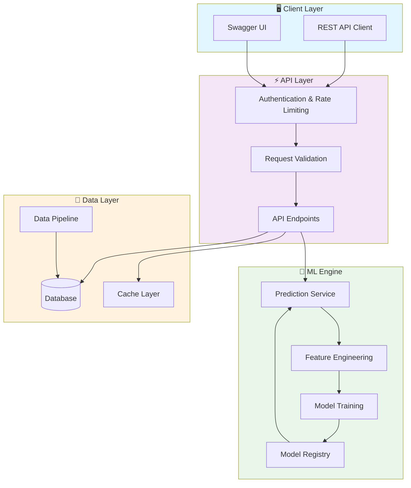
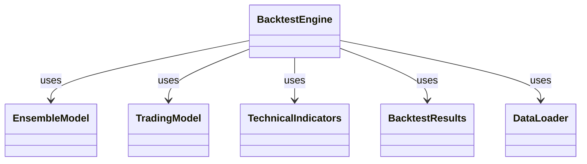

# 📈 Python Ml Trading Strategies

> Machine Learning framework for quantitative trading strategies with feature engineering, backtesting, and ensemble models

[](https://img.shields.io/badge/)
[](https://img.shields.io/badge/)
[](https://img.shields.io/badge/)
[](https://img.shields.io/badge/)
[](https://img.shields.io/badge/)
[](https://img.shields.io/badge/)
[](https://img.shields.io/badge/)
[](LICENSE)

[English](#english) | [Português](#português)

---

## English

### 🎯 Overview

**Python Ml Trading Strategies** is a production-grade Python application that showcases modern software engineering practices including clean architecture, comprehensive testing, containerized deployment, and CI/CD readiness.

The codebase comprises **2,142 lines** of source code organized across **17 modules**, following industry best practices for maintainability, scalability, and code quality.

### ✨ Key Features

- **📈 Strategy Engine**: Multiple trading strategy implementations with configurable parameters
- **🔄 Backtesting Framework**: Historical data simulation with realistic market conditions
- **📊 Performance Analytics**: Sharpe ratio, Sortino ratio, maximum drawdown, and more
- **⚡ Real-time Processing**: Low-latency data processing optimized for market speed
- **🤖 ML Pipeline**: End-to-end machine learning workflow from data to deployment
- **🔬 Feature Engineering**: Automated feature extraction and transformation
- **📊 Model Evaluation**: Comprehensive metrics and cross-validation
- **🚀 Model Serving**: Production-ready prediction API

### 🏗️ Architecture





### 🚀 Quick Start

#### Prerequisites

- Python 3.12+
- pip (Python package manager)

#### Installation

```bash
# Clone the repository
git clone https://github.com/galafis/python-ml-trading-strategies.git
cd python-ml-trading-strategies

# Create and activate virtual environment
python -m venv venv
source venv/bin/activate  # On Windows: venv\Scripts\activate

# Install dependencies
pip install -r requirements.txt
```

#### Running

```bash
# Run the application
python src/main.py
```

### 🧪 Testing

```bash
# Run all tests
pytest

# Run with coverage report
pytest --cov --cov-report=html

# Run specific test module
pytest tests/test_main.py -v

# Run with detailed output
pytest -v --tb=short
```

### 📁 Project Structure

```
python-ml-trading-strategies/
├── data/
│   ├── processed/
│   └── raw/
├── docs/          # Documentation
│   ├── images/
│   ├── AUDIT_SUMMARY.md
│   ├── FAQ.md
│   ├── USE_CASES.md
│   └── ml_pipeline.md
├── examples/
│   ├── complete_strategy.py
│   └── simple_strategy_synthetic_data.py
├── notebooks/
│   └── README.md
├── src/          # Source code
│   ├── backtesting/
│   │   ├── __init__.py
│   │   └── backtest_engine.py
│   ├── features/
│   │   ├── __init__.py
│   │   └── technical_indicators.py
│   ├── models/        # Data models
│   │   ├── __init__.py
│   │   └── ml_models.py
│   ├── strategies/    # Trading strategies
│   │   └── __init__.py
│   ├── utils/         # Utilities
│   │   ├── __init__.py
│   │   └── data_loader.py
│   └── __init__.py
├── tests/         # Test suite
│   ├── test_backtest_engine.py
│   ├── test_data_loader.py
│   ├── test_ml_models.py
│   └── test_technical_indicators.py
├── CHANGELOG.md
├── CONTRIBUTING.md
├── LICENSE
├── README.md
├── requirements.txt
└── setup.py
```

### 📊 Performance Metrics

The engine calculates comprehensive performance metrics:

| Metric | Description | Formula |
|--------|-------------|---------|
| **Sharpe Ratio** | Risk-adjusted return | (Rp - Rf) / σp |
| **Sortino Ratio** | Downside risk-adjusted return | (Rp - Rf) / σd |
| **Max Drawdown** | Maximum peak-to-trough decline | max(1 - Pt/Pmax) |
| **Win Rate** | Percentage of profitable trades | Wins / Total |
| **Profit Factor** | Gross profit / Gross loss | ΣProfit / ΣLoss |
| **Calmar Ratio** | Return / Max Drawdown | CAGR / MDD |
| **VaR (95%)** | Value at Risk | 5th percentile of returns |
| **Expected Shortfall** | Conditional VaR | E[R | R < VaR] |

### 🛠️ Tech Stack

| Technology | Description | Role |
|------------|-------------|------|
| **Python** | Core Language | Primary |
| **Gin** | Go web framework | Framework |
| **NumPy** | Numerical computing | Framework |
| **Pandas** | Data manipulation library | Framework |
| **Plotly** | Interactive visualization | Framework |
| **scikit-learn** | Machine learning library | Framework |
| **XGBoost** | Gradient boosting framework | Framework |

### 🤝 Contributing

Contributions are welcome! Please feel free to submit a Pull Request. For major changes, please open an issue first to discuss what you would like to change.

1. Fork the project
2. Create your feature branch (`git checkout -b feature/AmazingFeature`)
3. Commit your changes (`git commit -m 'Add some AmazingFeature'`)
4. Push to the branch (`git push origin feature/AmazingFeature`)
5. Open a Pull Request

### 📄 License

This project is licensed under the MIT License - see the [LICENSE](LICENSE) file for details.

### 👤 Author

**Gabriel Demetrios Lafis**
- GitHub: [@galafis](https://github.com/galafis)
- LinkedIn: [Gabriel Demetrios Lafis](https://linkedin.com/in/gabriel-demetrios-lafis)

---

## Português

### 🎯 Visão Geral

**Python Ml Trading Strategies** é uma aplicação Python de nível profissional que demonstra práticas modernas de engenharia de software, incluindo arquitetura limpa, testes abrangentes, implantação containerizada e prontidão para CI/CD.

A base de código compreende **2,142 linhas** de código-fonte organizadas em **17 módulos**, seguindo as melhores práticas do setor para manutenibilidade, escalabilidade e qualidade de código.

### ✨ Funcionalidades Principais

- **📈 Strategy Engine**: Multiple trading strategy implementations with configurable parameters
- **🔄 Backtesting Framework**: Historical data simulation with realistic market conditions
- **📊 Performance Analytics**: Sharpe ratio, Sortino ratio, maximum drawdown, and more
- **⚡ Real-time Processing**: Low-latency data processing optimized for market speed
- **🤖 ML Pipeline**: End-to-end machine learning workflow from data to deployment
- **🔬 Feature Engineering**: Automated feature extraction and transformation
- **📊 Model Evaluation**: Comprehensive metrics and cross-validation
- **🚀 Model Serving**: Production-ready prediction API

### 🏗️ Arquitetura


### 🚀 Início Rápido

#### Prerequisites

- Python 3.12+
- pip (Python package manager)

#### Installation

```bash
# Clone the repository
git clone https://github.com/galafis/python-ml-trading-strategies.git
cd python-ml-trading-strategies

# Create and activate virtual environment
python -m venv venv
source venv/bin/activate  # On Windows: venv\Scripts\activate

# Install dependencies
pip install -r requirements.txt
```

#### Running

```bash
# Run the application
python src/main.py
```

### 🧪 Testing

```bash
# Run all tests
pytest

# Run with coverage report
pytest --cov --cov-report=html

# Run specific test module
pytest tests/test_main.py -v

# Run with detailed output
pytest -v --tb=short
```

### 📁 Estrutura do Projeto

```
python-ml-trading-strategies/
├── data/
│   ├── processed/
│   └── raw/
├── docs/          # Documentation
│   ├── images/
│   ├── AUDIT_SUMMARY.md
│   ├── FAQ.md
│   ├── USE_CASES.md
│   └── ml_pipeline.md
├── examples/
│   ├── complete_strategy.py
│   └── simple_strategy_synthetic_data.py
├── notebooks/
│   └── README.md
├── src/          # Source code
│   ├── backtesting/
│   │   ├── __init__.py
│   │   └── backtest_engine.py
│   ├── features/
│   │   ├── __init__.py
│   │   └── technical_indicators.py
│   ├── models/        # Data models
│   │   ├── __init__.py
│   │   └── ml_models.py
│   ├── strategies/    # Trading strategies
│   │   └── __init__.py
│   ├── utils/         # Utilities
│   │   ├── __init__.py
│   │   └── data_loader.py
│   └── __init__.py
├── tests/         # Test suite
│   ├── test_backtest_engine.py
│   ├── test_data_loader.py
│   ├── test_ml_models.py
│   └── test_technical_indicators.py
├── CHANGELOG.md
├── CONTRIBUTING.md
├── LICENSE
├── README.md
├── requirements.txt
└── setup.py
```

### 📊 Performance Metrics

The engine calculates comprehensive performance metrics:

| Metric | Description | Formula |
|--------|-------------|---------|
| **Sharpe Ratio** | Risk-adjusted return | (Rp - Rf) / σp |
| **Sortino Ratio** | Downside risk-adjusted return | (Rp - Rf) / σd |
| **Max Drawdown** | Maximum peak-to-trough decline | max(1 - Pt/Pmax) |
| **Win Rate** | Percentage of profitable trades | Wins / Total |
| **Profit Factor** | Gross profit / Gross loss | ΣProfit / ΣLoss |
| **Calmar Ratio** | Return / Max Drawdown | CAGR / MDD |
| **VaR (95%)** | Value at Risk | 5th percentile of returns |
| **Expected Shortfall** | Conditional VaR | E[R | R < VaR] |

### 🛠️ Stack Tecnológica

| Tecnologia | Descrição | Papel |
|------------|-----------|-------|
| **Python** | Core Language | Primary |
| **Gin** | Go web framework | Framework |
| **NumPy** | Numerical computing | Framework |
| **Pandas** | Data manipulation library | Framework |
| **Plotly** | Interactive visualization | Framework |
| **scikit-learn** | Machine learning library | Framework |
| **XGBoost** | Gradient boosting framework | Framework |

### 🤝 Contribuindo

Contribuições são bem-vindas! Sinta-se à vontade para enviar um Pull Request.

### 📄 Licença

Este projeto está licenciado sob a Licença MIT - veja o arquivo [LICENSE](LICENSE) para detalhes.

### 👤 Autor

**Gabriel Demetrios Lafis**
- GitHub: [@galafis](https://github.com/galafis)
- LinkedIn: [Gabriel Demetrios Lafis](https://linkedin.com/in/gabriel-demetrios-lafis)
