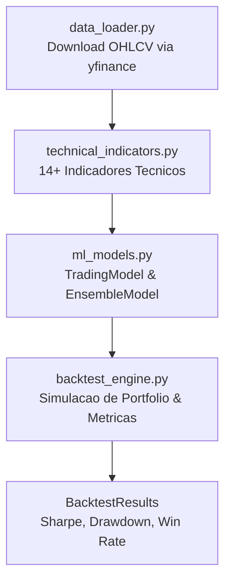
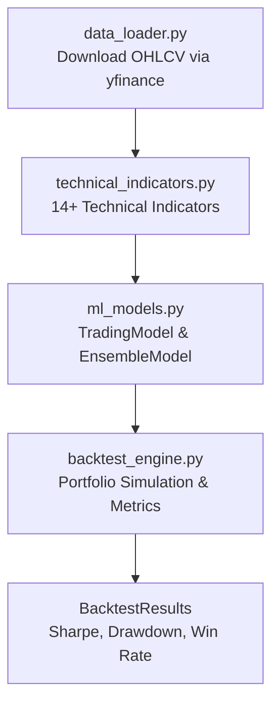

# Python ML Trading Strategies

Framework de Machine Learning para estrategias de trading quantitativo com engenharia de features, backtesting e modelos ensemble.

[](https://python.org)
[](https://scikit-learn.org)
[](https://xgboost.readthedocs.io)
[](https://lightgbm.readthedocs.io)
[](LICENSE)

[Portugues](#portugues) | [English](#english)

---

## Portugues

### Sobre

Projeto educacional que implementa um pipeline de ML para classificacao de movimentos de preco de acoes. O framework cobre: download de dados via Yahoo Finance, calculo de indicadores tecnicos, treinamento de modelos de classificacao (Random Forest, XGBoost, LightGBM, Logistic Regression), ensemble com votacao, e backtesting com custos de transacao.

**Aviso:** Projeto para fins educacionais. Nao constitui aconselhamento financeiro.

### Funcionalidades

- **Download de dados** via `yfinance` (OHLCV de qualquer ticker)
- **14+ indicadores tecnicos**: SMA, EMA, RSI, MACD, Bollinger Bands, ATR, Stochastic, OBV, ADX, VWAP, retornos e volatilidade em multiplos periodos
- **4 tipos de modelo**: Random Forest, XGBoost, LightGBM, Logistic Regression
- **Ensemble** com votacao hard ou soft (media de probabilidades)
- **Backtesting** com capital inicial, comissao, slippage e metricas de performance
- **Variavel alvo** configuravel: classificacao binaria ou 3 classes (down/neutral/up)
- **Divisao temporal** dos dados (sem shuffling, respeitando serie temporal)

### Arquitetura



### Inicio Rapido

```bash
# Clonar
git clone https://github.com/galafis/python-ml-trading-strategies.git
cd python-ml-trading-strategies

# Ambiente virtual
python -m venv venv
source venv/bin/activate  # Windows: venv\Scripts\activate

# Dependencias
pip install -r requirements.txt

# Executar exemplo com dados sinteticos (sem internet)
cd examples
PYTHONPATH=$PYTHONPATH:../src python simple_strategy_synthetic_data.py

# Executar exemplo com dados reais (requer internet)
PYTHONPATH=$PYTHONPATH:../src python complete_strategy.py
```

### Testes

```bash
PYTHONPATH=$PYTHONPATH:. pytest tests/ -v
```

### Estrutura do Projeto

```
python-ml-trading-strategies/
├── src/
│   ├── backtesting/
│   │   └── backtest_engine.py    # Motor de backtesting e metricas
│   ├── features/
│   │   └── technical_indicators.py  # Calculo de indicadores tecnicos
│   ├── models/
│   │   └── ml_models.py          # TradingModel e EnsembleModel
│   └── utils/
│       └── data_loader.py        # Download de dados e preparacao
├── examples/
│   ├── complete_strategy.py      # Pipeline completo com dados reais
│   └── simple_strategy_synthetic_data.py  # Pipeline com dados sinteticos
├── notebooks/
│   ├── 01_getting_started_tutorial.ipynb
│   └── 02_advanced_analysis.ipynb
├── tests/
│   ├── test_backtest_engine.py
│   ├── test_data_loader.py
│   ├── test_ml_models.py
│   └── test_technical_indicators.py
├── docs/
│   └── ml_pipeline.md
├── requirements.txt
├── setup.py
└── LICENSE
```

### Metricas de Backtesting

| Metrica | Descricao |
|---------|-----------|
| Total Return | Retorno total do portfolio |
| Annualized Return | Retorno anualizado (base 252 dias) |
| Sharpe Ratio | Retorno ajustado ao risco |
| Max Drawdown | Maior queda do pico ao vale |
| Win Rate | Percentual de trades lucrativos |
| Profit Factor | Lucro bruto / Perda bruta |

### Tecnologias

| Tecnologia | Uso |
|------------|-----|
| Python 3.9+ | Linguagem principal |
| NumPy / Pandas | Manipulacao de dados |
| scikit-learn | Modelos ML e preprocessamento |
| XGBoost | Gradient boosting |
| LightGBM | Gradient boosting |
| yfinance | Download de dados de mercado |
| matplotlib | Visualizacao (exemplos e notebooks) |
| joblib | Serializacao de modelos |

---

## English

### About

Educational project implementing an ML pipeline for stock price movement classification. The framework covers: data download via Yahoo Finance, technical indicator calculation, classification model training (Random Forest, XGBoost, LightGBM, Logistic Regression), ensemble with voting, and backtesting with transaction costs.

**Disclaimer:** Educational project only. Not financial advice.

### Features

- **Data download** via `yfinance` (OHLCV for any ticker)
- **14+ technical indicators**: SMA, EMA, RSI, MACD, Bollinger Bands, ATR, Stochastic, OBV, ADX, VWAP, multi-period returns and volatility
- **4 model types**: Random Forest, XGBoost, LightGBM, Logistic Regression
- **Ensemble** with hard or soft voting (probability averaging)
- **Backtesting** with initial capital, commission, slippage and performance metrics
- **Configurable target**: binary or 3-class classification (down/neutral/up)
- **Time-series split** (no shuffling, respects temporal order)

### Architecture



### Quick Start

```bash
# Clone
git clone https://github.com/galafis/python-ml-trading-strategies.git
cd python-ml-trading-strategies

# Virtual environment
python -m venv venv
source venv/bin/activate  # Windows: venv\Scripts\activate

# Dependencies
pip install -r requirements.txt

# Run example with synthetic data (no internet needed)
cd examples
PYTHONPATH=$PYTHONPATH:../src python simple_strategy_synthetic_data.py

# Run example with real data (requires internet)
PYTHONPATH=$PYTHONPATH:../src python complete_strategy.py
```

### Tests

```bash
PYTHONPATH=$PYTHONPATH:. pytest tests/ -v
```

### Backtesting Metrics

| Metric | Description |
|--------|-------------|
| Total Return | Total portfolio return |
| Annualized Return | Annualized return (252-day basis) |
| Sharpe Ratio | Risk-adjusted return |
| Max Drawdown | Largest peak-to-trough decline |
| Win Rate | Percentage of profitable trades |
| Profit Factor | Gross profit / Gross loss |

### Tech Stack

| Technology | Usage |
|------------|-------|
| Python 3.9+ | Core language |
| NumPy / Pandas | Data manipulation |
| scikit-learn | ML models and preprocessing |
| XGBoost | Gradient boosting |
| LightGBM | Gradient boosting |
| yfinance | Market data download |
| matplotlib | Visualization (examples and notebooks) |
| joblib | Model serialization |

---

## Autor / Author

**Gabriel Demetrios Lafis**
- GitHub: [@galafis](https://github.com/galafis)
- LinkedIn: [Gabriel Demetrios Lafis](https://linkedin.com/in/gabriel-demetrios-lafis)

## Licenca / License

MIT License - see [LICENSE](LICENSE).
