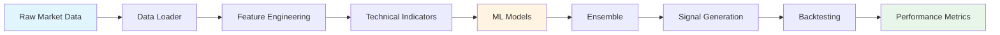
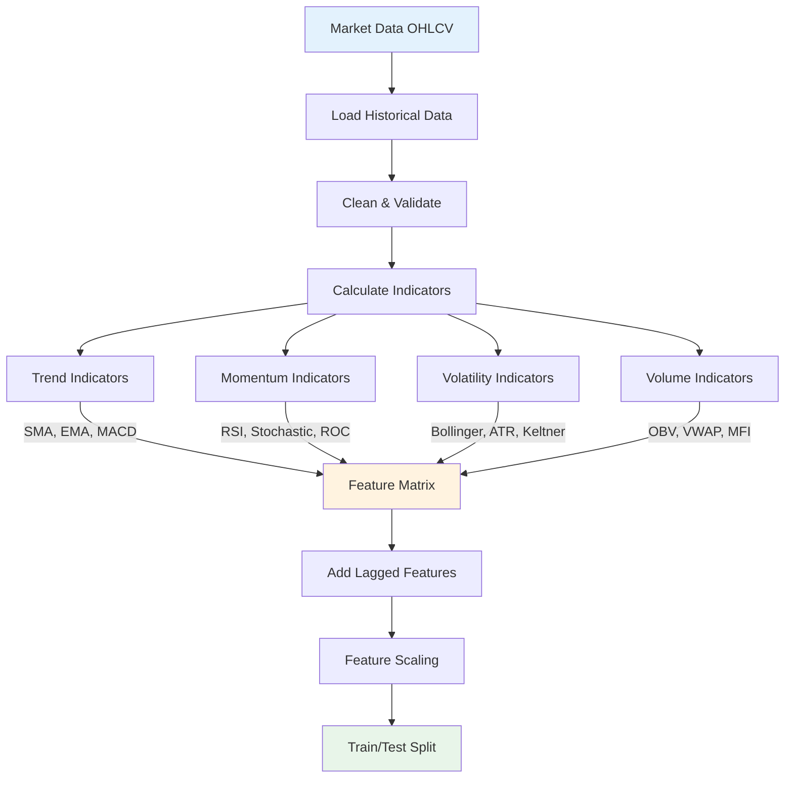
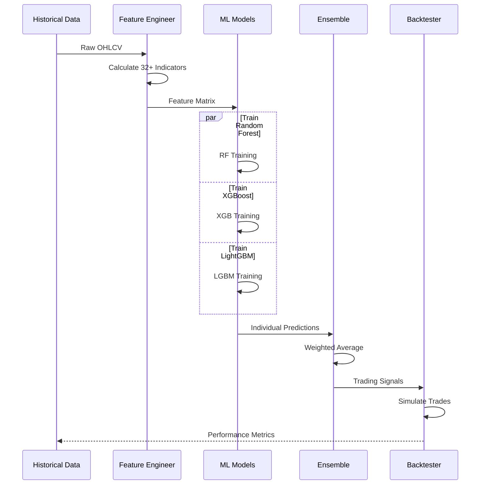
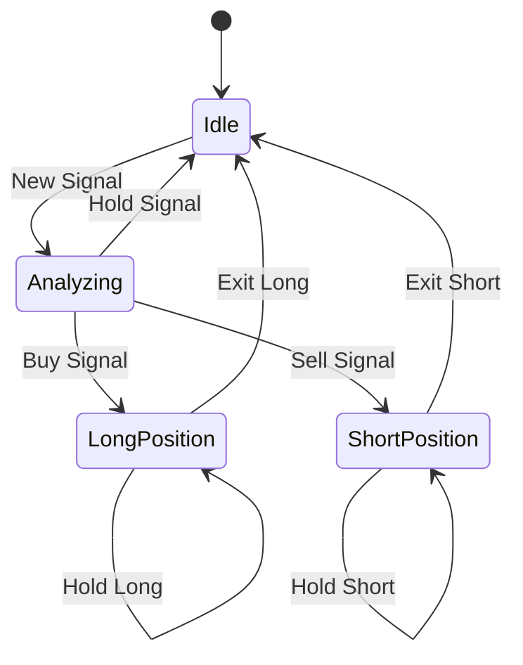
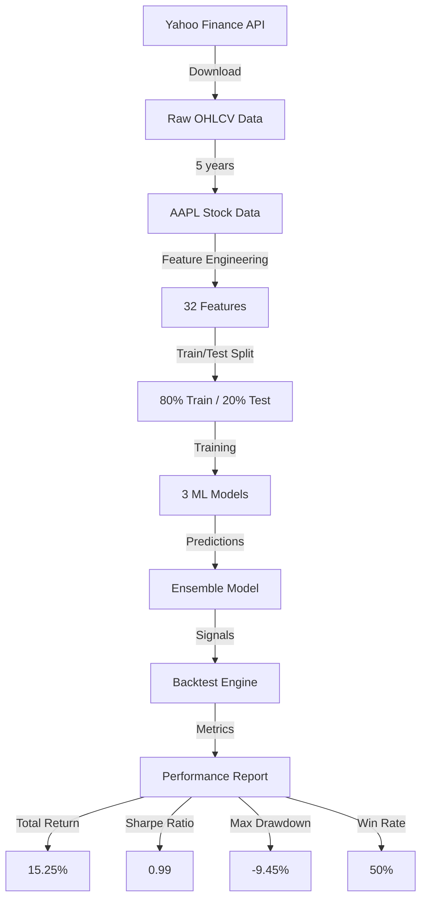

# 🤖 ML Pipeline Documentation

## Complete ML Trading Pipeline



## Detailed Feature Engineering Flow



## Model Training & Evaluation



## Feature Engineering Details

### 32+ Technical Indicators

#### Trend Indicators
- **SMA** (Simple Moving Average): 10, 20, 50, 200 periods
- **EMA** (Exponential Moving Average): 12, 26 periods
- **MACD** (Moving Average Convergence Divergence)
- **MACD Signal** & **MACD Histogram**

#### Momentum Indicators
- **RSI** (Relative Strength Index): 14 periods
- **Stochastic Oscillator**: %K and %D
- **ROC** (Rate of Change): 10 periods
- **Williams %R**: 14 periods

#### Volatility Indicators
- **Bollinger Bands**: Upper, Middle, Lower
- **Bollinger Band Width**
- **ATR** (Average True Range): 14 periods
- **Keltner Channels**: Upper, Middle, Lower

#### Volume Indicators
- **OBV** (On-Balance Volume)
- **VWAP** (Volume Weighted Average Price)
- **MFI** (Money Flow Index): 14 periods
- **Volume Rate of Change**

#### Statistical Features
- **Returns**: Daily, log returns
- **Volatility**: Rolling std (20 periods)
- **Skewness** & **Kurtosis**: Rolling 20 periods
- **Z-Score**: Price normalization

## Model Architecture

### Random Forest
```
RandomForestClassifier(
    n_estimators=100,
    max_depth=10,
    min_samples_split=20,
    random_state=42
)
```

### XGBoost
```
XGBClassifier(
    n_estimators=100,
    max_depth=5,
    learning_rate=0.1,
    random_state=42
)
```

### LightGBM
```
LGBMClassifier(
    n_estimators=100,
    max_depth=5,
    learning_rate=0.1,
    random_state=42
)
```

### Ensemble Strategy
```python
ensemble_prediction = (
    0.4 * rf_prediction +
    0.3 * xgb_prediction +
    0.3 * lgbm_prediction
)
```

## Backtesting Engine



### Performance Metrics

| Metric | Formula | Description |
|--------|---------|-------------|
| **Total Return** | `(Final - Initial) / Initial` | Overall profit/loss |
| **Annualized Return** | `(1 + Total Return)^(252/days) - 1` | Yearly return |
| **Sharpe Ratio** | `(Return - RiskFree) / Volatility` | Risk-adjusted return |
| **Max Drawdown** | `min((Peak - Trough) / Peak)` | Largest peak-to-trough decline |
| **Win Rate** | `Winning Trades / Total Trades` | Percentage of profitable trades |
| **Profit Factor** | `Gross Profit / Gross Loss` | Profitability ratio |

## Signal Generation Logic

```python
def generate_signals(predictions, threshold=0.5):
    """
    Convert ML predictions to trading signals
    
    Args:
        predictions: Model output probabilities
        threshold: Decision threshold
    
    Returns:
        signals: 1 (Buy), -1 (Sell), 0 (Hold)
    """
    signals = np.where(predictions > threshold + 0.1, 1,  # Strong buy
              np.where(predictions < threshold - 0.1, -1, # Strong sell
              0))  # Hold
    return signals
```

## Data Flow Example



## Optimization Strategies

### Hyperparameter Tuning
- Grid Search for optimal parameters
- Cross-validation (5-fold)
- Walk-forward optimization

### Feature Selection
- Correlation analysis
- Feature importance ranking
- Recursive feature elimination

### Risk Management
- Position sizing based on volatility
- Stop-loss orders
- Take-profit targets
- Maximum position limits

## Future Enhancements

1. **Deep Learning Models**
   - LSTM for sequence prediction
   - CNN for pattern recognition
   - Transformer models

2. **Alternative Data**
   - Sentiment analysis
   - News feeds
   - Social media signals

3. **Portfolio Optimization**
   - Multi-asset allocation
   - Risk parity
   - Mean-variance optimization

4. **Real-time Deployment**
   - Live data streaming
   - Low-latency prediction
   - Automated execution
